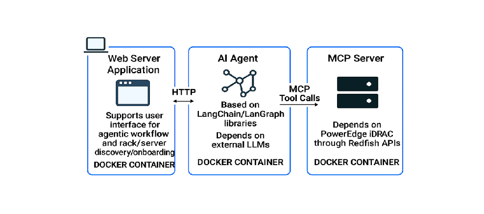

# Agentic Integration Test Suite

The LLM-powered integration tests that validate how AI agents interact with the Dell iDRAC Redfish MCP Server.

## Why Agentic Testing?

Traditional integration tests verify API functionality. Agentic tests verify that:
- Tool descriptions are clear and unambiguous
- Parameter schemas are intuitive for LLMs
- Multi-step workflows execute correctly
- Tool selection logic works in realistic scenarios
- Error handling is graceful and informative

**Agentic tests complement (not replace) traditional integration tests.**

The deployment view of agentic integration test suite which is provided with in the repo can be depicted in the picture below.


For deep dive architecture details of agentic integration test suite, See [ARCHITECTURE_AGENTIC_INTEGRATION_TEST.md](../docs/ARCHITECTURE_AGENTIC_INTEGRATION_TEST.md)

You can read further about the reference iDRAC MCP Server design philosophy at [Design Philosophy](../docs/DESIGN_PHILOSOPHY.md)


---

## Quick Start

### Option 1: Interactive Chat UI (Recommended for exploration) with docker based deployment

You are find the docker deployment instructions and test process at [installation instructions](../docs/DEPLOY.md).


### Option 2: Automated Test Suite

```bash
cd integration_tests_agentic

# Install dependencies
pip3 install --upgrade pip
pip3 install -r requirements.txt
pip3 install -r ../mcp_idrac_server/requirements.txt
pip3 install -e langchain-dev-genai

# Set dev_genai credentials
export DEV_GENAI_API_URL="https://your-genai-url.com/v1"
export DEV_GENAI_API_KEY="your-api-key"

# Run smoke tests
./run_tests.sh --smoke

# Run all tier 1 tests
./run_tests.sh --tier1

# Run with verbose output
./run_tests.sh --smoke --verbose
```

---

## Configuration

### Test Configuration (`config/test_config.yaml`)

**LLM settings:**
```yaml
llm:
  provider: "ollama"
  ollama:
    model: "llama3.2:3b"
    temperature: 0
```

**Agent settings:**
```yaml
agent:
  type: "react"
  max_iterations: 10
  max_execution_time: 30
```

**RAG settings:**
```yaml
rag:
  enabled: true
  pdf_folder: "./data/pdfs"
  chunk_size: 1500
  embedding_model: "all-mpnet-base-v2"
```

### Environment Variables

**For dev_genai LLM (default):**
```bash
export DEV_GENAI_API_URL="https://your-genai-url.com/v1"
export DEV_GENAI_API_KEY="your-api-key"
```

**For live iDRAC testing:**
```bash
export IDRAC_IP="http://192.168.1.100"
export IDRAC_USERNAME="admin"
export IDRAC_PASSWORD="password"
./start_chat_ui.sh --live
```

**For mock testing (default):**
```bash
./start_chat_ui.sh  # Uses mock iDRAC on port 8002
```

---

## License

Licensed under the Apache License, Version 2.0
