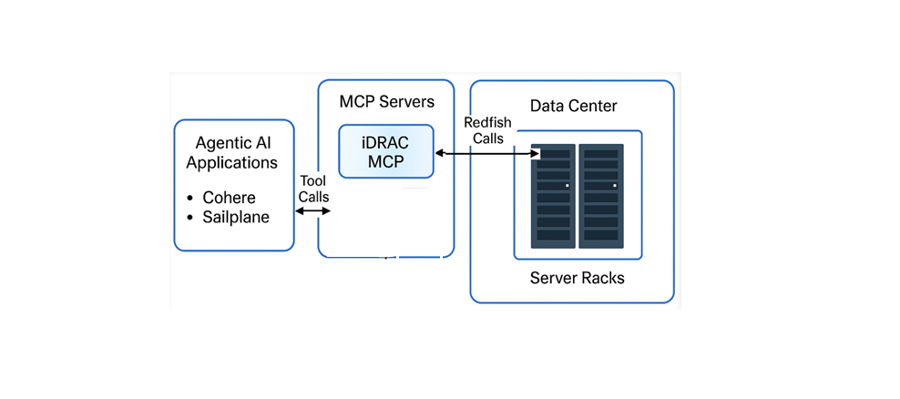

# Reference iDRAC MCP Server

MCP is a vendor-neutral standardized to discover and invoke MCP tool calls. For more to get started on MCP, See [developer resources](https://modelcontextprotocol.io/docs/getting-started/intro) 

You can also read the latest specification at [developer resources](https://modelcontextprotocol.io/specification/2025-06-18). 

This reference Model Context Protocol (MCP) server exposes Dell iDRAC Redfish API operations as callable tools. It dynamically generates tools from OpenAPI specifications with configurable authentication and Docker support as a deployment option.

You can read further about the reference iDRAC MCP Server design philosophy at [Design Philosophy](../docs/DESIGN_PHILOSOPHY.md)

## Architecture Details

A high level reference deployment of iDRAC MPC Server will look as depicted in the picture below.



For deep dive architecture details of reference iDRAC MPC Server, See [ARCHITECTURE.md](../docs/ARCHITECTURE.md)

The deployment view of agentic integration test suite which is provided with in the repo can be depicted in the picture below.


For deep dive architecture details of agentic integration test suite, See [ARCHITECTURE_AGENTIC_INTEGRATION_TEST.md](../docs/ARCHITECTURE_AGENTIC_INTEGRATION_TEST.md)


## Quick Start 

### Docker Deployment

```bash
# Using Docker Compose
docker-compose up -d

# View logs
docker-compose logs -f

# Stop
docker-compose down
```

**Server runs at:** `http://localhost:8000/mcp`

### Installation as standalone process

```bash
# Install dependencies following python best practices
pip install -r requirements.txt

# Default (stdio transport)
python -m src

# Streamable-HTTP transport
python -m src --transport streamable-http --host 0.0.0.0 --port 8000

# Validate configuration only
python -m src --validate-only
```

## Available Tools

Tool call support is the cornerstone of this solution’s usability. In this reference implementation, we have adopted an approach where tools are user-configurable based on their agentic use case needs. The implementation exposes a variety of tool calls, allowing users to select and define which tools their instance of the iDRAC MCP server will provide by configuring the mcp_idrac_server/config/tools.yaml file.

The Redfish methods supported by iDRAC are defined in the OpenAPI.yaml, which is publicly available as specified by the DMTF Redfish standard. This reference implementation includes a script (utils/generate_tools_reference.py) that converts the Redfish OpenAPI definition into MCP tool calls, enabling seamless integration. The resulting reference tool definitions are provided in mcp_idrac_server/config/tools_reference.yaml.

We encourage users to review this reference YAML and choose the tool calls that best fit their use cases.

Users can pick and choose the tools and add it in to tools.yaml. The default setting includes tools like:
- **System Management:** get_system_info, list_systems, get_service_root
- **Power Control:** reset_system, reset_manager
- **BIOS Configuration:** get_bios_settings, get_bios_pending_settings, get_bios_registry
- **Hardware Inventory:** get_memory_info, get_storage_info, get_ethernet_interfaces, get_processors
- **User Management:** list_user_accounts, get_user_account, create_user_account, update_user_account, delete_user_account


## Tool Configuration

Edit `config/tools.yaml` & `config/workflows.yaml` to include the tools for your agentic workflows:

```yaml
server:
  verify_ssl: false  # Set to true in production
  timeout: 30
  max_retries: 3

tools:
  - name: get_system_info
    description: Get detailed information about a specific system
    operation_id: GET_/redfish/v1/Systems/{ComputerSystemId}
    enabled: true
    parameter_mappings:
      - tool_param_name: system_id
        api_param_name: ComputerSystemId
        location: path
        required: true
        default: "System.Embedded.1"
```


## Usage

All tools require authentication parameters per request:

```python
# Basic Authentication (username + password)
get_system_info(
    idrac_ip="<>",
    username="<username>",
    password="<password>",
    system_id="System.Embedded.1"
)

# Token Authentication (auth_token only)
get_system_info(
    idrac_ip="<>",
    auth_token="your-x-auth-token-here",
    system_id="System.Embedded.1"
)
```


## Troubleshooting

If you need to debug things, we have included a few tips and tricks we learned along the way in [DEBUGGING.md](../docs/DEBUGGING.md).

## Testing

For deep dive details of agentic integration test suite, See [ARCHITECTURE_AGENTIC_INTEGRATION_TEST.md](docs/ARCHITECTURE_AGENTIC_INTEGRATION_TEST.md)


## Security Considerations

- Never hardcode credentials in configuration files
- Always use SSL verification in production (`verify_ssl: true`)
- Restrict MCP server access to trusted networks
- Use least-privilege accounts for iDRAC API access
- Use environment variables or secret management for sensitive data

## Requirements

- Python 3.9+
- Dell iDRAC 9 or 10 with Redfish API enabled
- Network access to iDRAC management interface

## References

- [Dell iDRAC Redfish API Guide](https://www.dell.com/support/article/en-in/sln310624/)
- [Redfish API Specification](https://www.dmtf.org/standards/redfish)
- [FastMCP Documentation](https://github.com/jlowin/fastmcp)
- [Model Context Protocol](https://modelcontextprotocol.io/)

## Support

For development information, see [DEVELOPER_GUIDE.md](DEVELOPER_GUIDE.md)
For Docker deployment, see [DOCKER_DEPLOYMENT.md](DOCKER_DEPLOYMENT.md)
